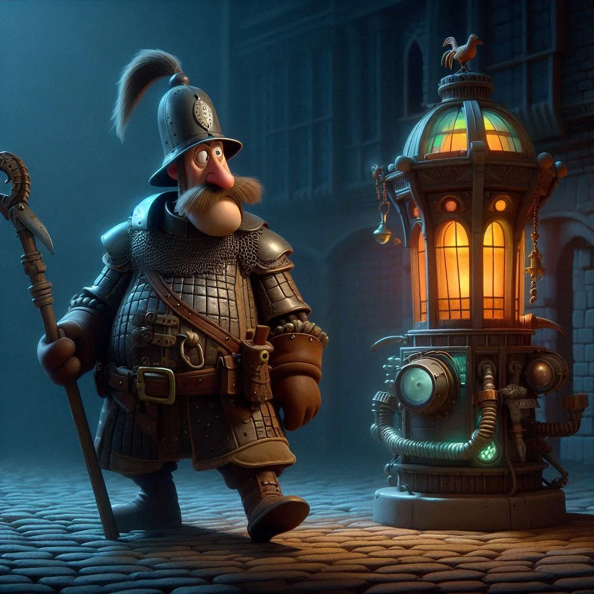

# --- Day 6: Guard Gallivant ---

The Historians use their fancy device again, this time to whisk you all away to the North Pole prototype suit manufacturing lab... in the year 1518! It turns out that having direct access to history is very convenient for a group of historians.

You still have to be careful of time paradoxes, and so it will be important to avoid anyone from 1518 while The Historians search for the Chief. Unfortunately, a single guard is patrolling this part of the lab.

Maybe you can work out where the guard will go ahead of time so that The Historians can search safely?

You start by making a map (your puzzle input) of the situation. For example:

```shell
....#.....
.........#
..........
..#.......
.......#..
..........
.#..^.....
........#.
#.........
......#...
```

The map shows the current position of the guard with ^ (to indicate the guard is currently facing up from the perspective of the map). Any obstructions - crates, desks, alchemical reactors, etc. - are shown as #.

Lab guards in 1518 follow a very strict patrol protocol which involves repeatedly following these steps:

If there is something directly in front of you, turn right 90 degrees.
Otherwise, take a step forward.
Following the above protocol, the guard moves up several times until she reaches an obstacle (in this case, a pile of failed suit prototypes):

```shell
....#.....
....^....#
..........
..#.......
.......#..
..........
.#........
........#.
#.........
......#...
```

Because there is now an obstacle in front of the guard, she turns right before continuing straight in her new facing direction:

```shell
....#.....
........>#
..........
..#.......
.......#..
..........
.#........
........#.
#.........
......#...
```

Reaching another obstacle (a spool of several very long polymers), she turns right again and continues downward:

```shell
....#.....
.........#
..........
..#.......
.......#..
..........
.#......v.
........#.
#.........
......#...
```

This process continues for a while, but the guard eventually leaves the mapped area (after walking past a tank of universal solvent):

```shell
....#.....
.........#
..........
..#.......
.......#..
..........
.#........
........#.
#.........
......#v..
```

By predicting the guard's route, you can determine which specific positions in the lab will be in the patrol path. Including the guard's starting position, the positions visited by the guard before leaving the area are marked with an X:

```shell
....#.....
....XXXXX#
....X...X.
..#.X...X.
..XXXXX#X.
..X.X.X.X.
.#XXXXXXX.
.XXXXXXX#.
#XXXXXXX..
......#X..
```

In this example, the guard will visit 41 distinct positions on your map.

Predict the path of the guard. How many distinct positions will the guard visit before leaving the mapped area?

# --- Part Two ---

While The Historians begin working around the guard's patrol route, you borrow their fancy device and step outside the lab. From the safety of a supply closet, you time travel through the last few months and record the nightly status of the lab's guard post on the walls of the closet.

Returning after what seems like only a few seconds to The Historians, they explain that the guard's patrol area is simply too large for them to safely search the lab without getting caught.

Fortunately, they are pretty sure that adding a single new obstruction won't cause a time paradox. They'd like to place the new obstruction in such a way that the guard will get stuck in a loop, making the rest of the lab safe to search.

To have the lowest chance of creating a time paradox, The Historians would like to know all of the possible positions for such an obstruction. The new obstruction can't be placed at the guard's starting position - the guard is there right now and would notice.

In the above example, there are only 6 different positions where a new obstruction would cause the guard to get stuck in a loop. The diagrams of these six situations use O to mark the new obstruction, | to show a position where the guard moves up/down, - to show a position where the guard moves left/right, and + to show a position where the guard moves both up/down and left/right.

Option one, put a printing press next to the guard's starting position:

```shell
....#.....
....+---+#
....|...|.
..#.|...|.
....|..#|.
....|...|.
.#.O^---+.
........#.
#.........
......#...
```

Option two, put a stack of failed suit prototypes in the bottom right quadrant of the mapped area:

```shell
....#.....
....+---+#
....|...|.
..#.|...|.
..+-+-+#|.
..|.|.|.|.
.#+-^-+-+.
......O.#.
#.........
......#...
```

Option three, put a crate of chimney-squeeze prototype fabric next to the standing desk in the bottom right quadrant:

```shell
....#.....
....+---+#
....|...|.
..#.|...|.
..+-+-+#|.
..|.|.|.|.
.#+-^-+-+.
.+----+O#.
#+----+...
......#...
```

Option four, put an alchemical retroencabulator near the bottom left corner:

```shell
....#.....
....+---+#
....|...|.
..#.|...|.
..+-+-+#|.
..|.|.|.|.
.#+-^-+-+.
..|...|.#.
#O+---+...
......#...
```

Option five, put the alchemical retroencabulator a bit to the right instead:

```shell
....#.....
....+---+#
....|...|.
..#.|...|.
..+-+-+#|.
..|.|.|.|.
.#+-^-+-+.
....|.|.#.
#..O+-+...
......#...
```

Option six, put a tank of sovereign glue right next to the tank of universal solvent:

```shell
....#.....
....+---+#
....|...|.
..#.|...|.
..+-+-+#|.
..|.|.|.|.
.#+-^-+-+.
.+----++#.
#+----++..
......#O..
```

It doesn't really matter what you choose to use as an obstacle so long as you and The Historians can put it into position without the guard noticing. The important thing is having enough options that you can find one that minimizes time paradoxes, and in this example, there are 6 different positions you could choose.

You need to get the guard stuck in a loop by adding a single new obstruction. How many different positions could you choose for this obstruction?

